  <h2>Muhammad Daffa Ma’arif</h2>
  
<b>Software Engineer • AI Systems & Distributed Architecture</b>

  

    Constructing deterministic engines in an uncertain computational world. 
    Architecting autonomous multi-agent runtimes, continuous telemetry streams, and resilient infrastructure. 
    Keeping steady order when ambient data drifts.
  

   

  

  
<i>&ldquo;Order in the noise, permanence in the stream.&rdquo;</i>

   

  

    

  <!-- Telemetry & Stats -->
  
  

   
  
  

   

  

  

